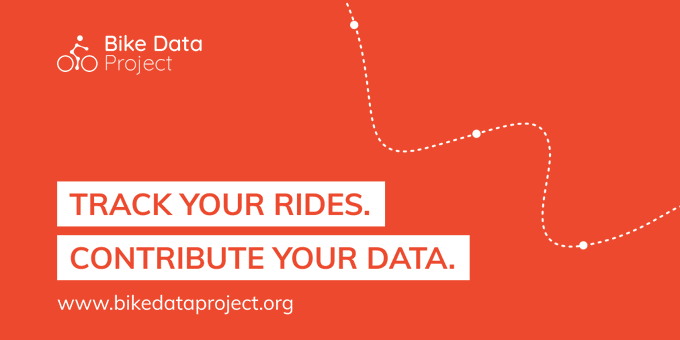

# Welcome!

This wiki serves as a documentation platform for all volunteers involved in the Bike Data Project. For now, we mainly use it to share the notes of our meetups and useful links. There's more to come! 🎉

### **Let's get started!**

* New to this project? Please go through this [introductory presentation](introductory-presentation.md) to get a better understanding of the Bike Data Project.
* As part of our current crowdsourcing campaign in Brussels, we're organising a [series of meetups](https://www.meetup.com/Civic-Lab-Brussels/) & you're invited!
* All aggregated anonymized data collected by the Bike Data Project will be published as open data. Join [our Data Dive event on Friday 13/11](https://bikedatadive.eventbrite.be/) to be among the first to dive into the data! 
* Want to be more involved? [Join the Bike Data Project community on Slack](https://join.slack.com/t/bikedataproject/shared_invite/zt-hr00amgw-elYn9WbdFHLta8qQKW_wvQ).


🚧 This wiki will _always_ be under construction — if something is missing or wrong, please contact us at bikedataproject@openknowledge.be; and we'll make sure to add or fix it. 🚧  
  
You are welcome to contribute as well!


