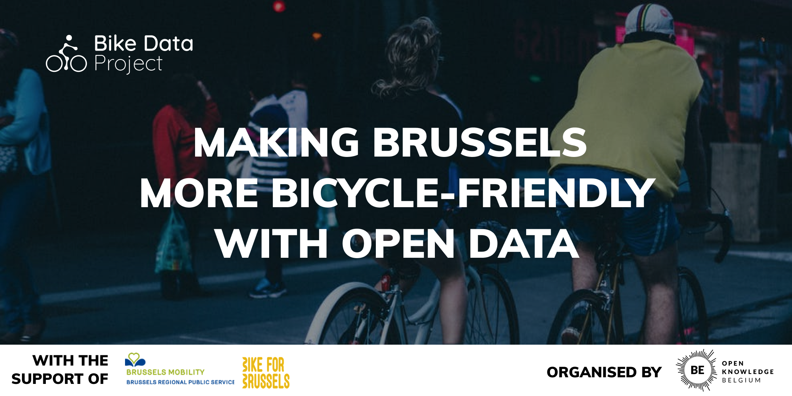

# Data Dive event 11/12

## Data Dive event 11/12

On Friday December 11, we'd like to invite you as a cyclist, data analyst, mobility planner, city planner, activist or journalist to join us during our data dive event, where we want to explore the opportunities of a more bicycle-friendly city with open data.

**What will we do?**  
During this Data Dive event, we will both exchange ideas on how we can build a more bicycle-friendly city with open data and explore the data collected by cyclists in Brussels. After the event, we will also make the cycling data available as open data.

**Where is the event taking place?**  
Please note that due to the COVID-19 pandemic, our data dive event will take place online. Online events take more energy, that’s why we’ll make it a little shorter: from 14:00 to 16:00.

**Do I need a technical profile to come?**  
Absolutely not! Just your ambition to make cities better for cyclists.

### Register here: [https://bikedatadive.eventbrite.be/](https://bikedatadive.eventbrite.be/)

## Presentations

* General presentation of the project:



* Technical Overview:



