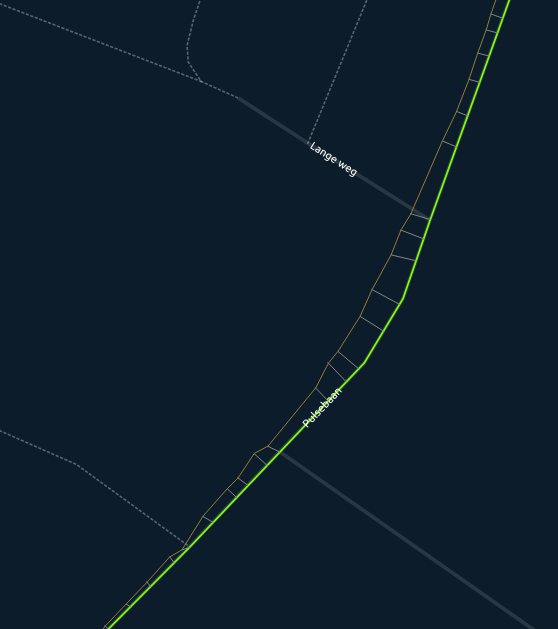
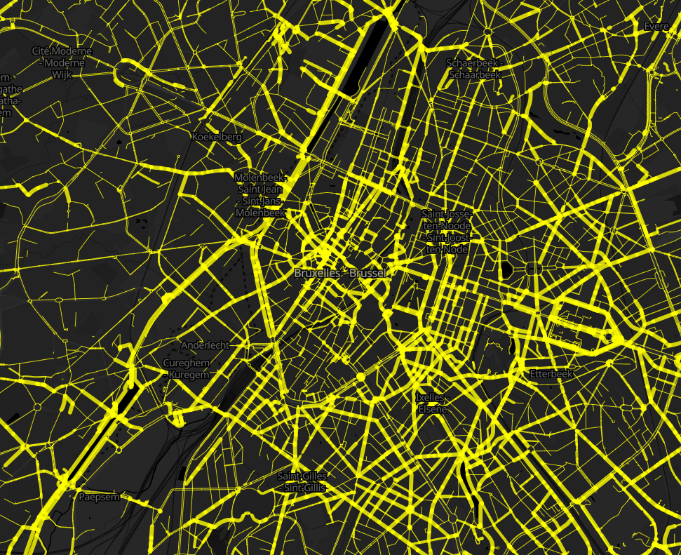
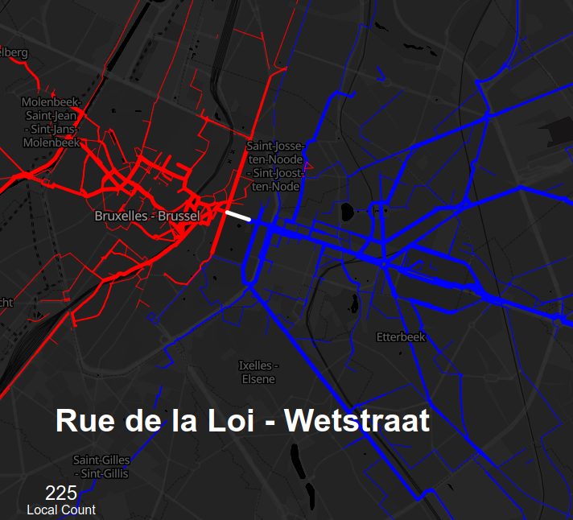

# Bicycle Counts Data

## Bicycle Counts Data

The Bike Data Project collects bicycle trips. We match these trips to the road network by trying to figure out what infrastructure each cyclist used:

Doing this for all cycling tracks in a area gives us a few different sets of data:

* The \# of cyclists per link on the network in both forward an backward directions.
* The routes cyclists perfer to take on the network.
* Where cyclists come from and where they go to in a certain area.

This is what the network looks like after doing this for Brussels:

We also calculate, per edge of the network, what other edges were used in trips passing by the segment. This gives us a view on how cyclists use each part of the road network and where they are coming from \(in blue\) and going to \(in red\):

## Datasets

**for new we only do this for Brussels, we are working on a global dataset**

We publish a few datasets:

* The road network with the bicycle counts on it: [download](https://data.bikedataproject.org/counts/network.shp.zip)
* Only the part of the network with bicycle traffic: [download](https://data.bikedataproject.org/counts/network-counts.geojson.zip)
* The Origin Destination trees per edge in the network: [here](https://data.bikedataproject.org/counts/trees/)

The data is published under a [Creative Commons Attribution 4.0 International license](https://creativecommons.org/licenses/by/4.0/).

Some more useful information:

* The data contains data collected from 2015 until now. 
* The data is updated every 15 mins.
* We only publish counts where there is data on more than 3 individual contributors.

